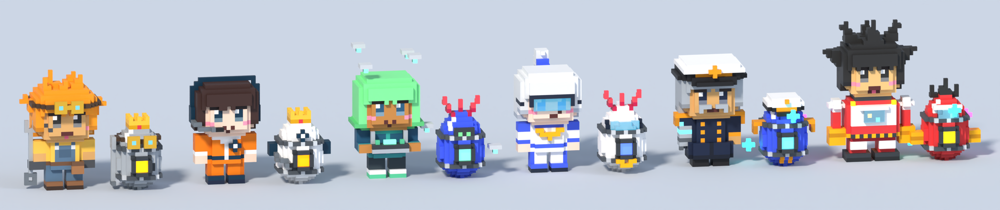
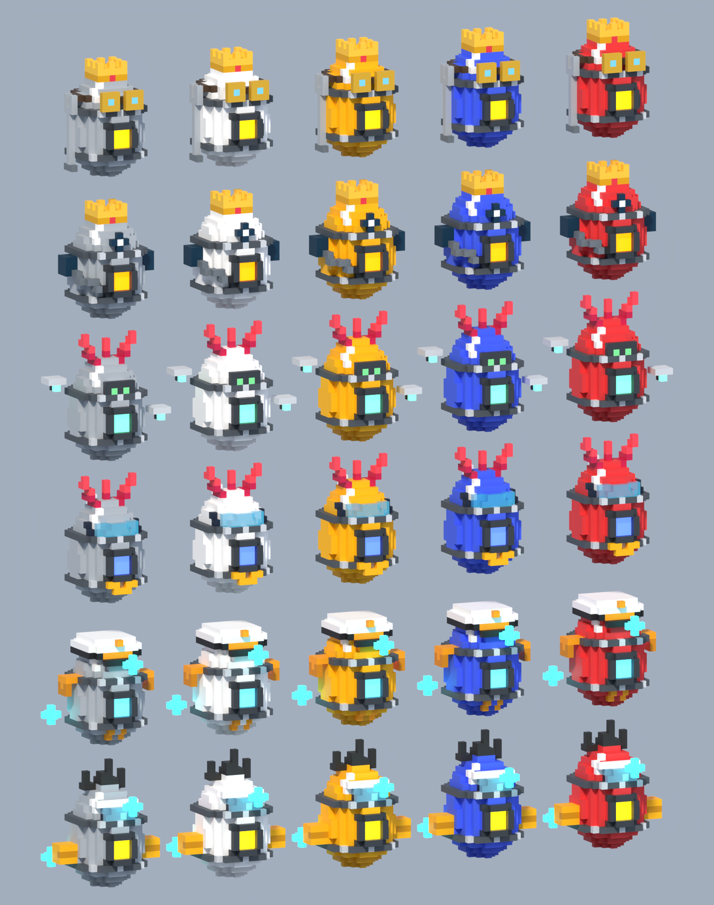

# Steal a Chibi! - Art spec sheet

Generated from the config files by `lune run tools/gen-art-spec`. Edit the configs, then regenerate.

## Global rules

- **Original IP only.** Archetypes are fine; no existing characters, outfits, hair-and-colour combos, logos or catchphrases.
- **All ages.** Chibi proportions (about 2.5 heads tall), modest outfits, no romance or fanservice, no gore. Demons, reapers and ghosts are cute-cool, never scary.
- **Look.** Bright cel-shaded, flat materials, strong outlines (inverted-hull meshes preferred; Highlights are reserved for mutations because Roblox caps them at 31 on screen), saturated palettes, soft bloom.
- **Swapping placeholders.** Put a Model named after the asset slot (for example `Char_KohanaNineTail`) in `ReplicatedStorage.Assets.Characters`. Feet at the model's bottom, facing -Z. The game scales it for size tiers and adds auras and mutation effects automatically.
- **Animations.** Idle, emote and hatch-pose names below map to keys in the config (`Idle`, `Emote`, `HatchPose`). The placeholder system fakes them with tweens; real animations can replace them later.

## Rarity auras

| Rarity | UI colour | Egg ornament | Aura |
|---|---|---|---|
| Common | #B8C0CC | Plain | none |
| Uncommon | #4CD964 | Banded | none |
| Rare | #3FA9F5 | Gem | none |
| Epic | #A259FF | Wings | sparkles, size 1 |
| Legendary | #FFC93C | Crown | sparkles, size 1.5 |
| Mythic | #FF4757 | Horns | sparkles, size 2 |
| Cosmic | #34E7E4 -> #FF4FD8 | Stars | sparkles, size 2.5 + point light |
| Secret | #141414 -> #7CFF4F | Glitch | sparkles, size 3 + point light |
| Divine | #FFF6D5 -> #FFD86B | Halo | sparkles, size 3.5 + point light |
| Eternal | #FF9ECF -> #8FE3FF | SakuraCrystal | sparkles, size 4 + point light |

## Eggs

Readability rule: **shape/ornament = rarity, colour = cosmetic only, overlay = zone.** Size is shown as physical scale; mutations are visible on the shell before pickup. The base shell is a 2.2 x 3.0 x 2.2 stud oval scaled by size tier.

### Shell ornament by rarity

| Rarity | Ornament |
|---|---|
| Common | plain oval |
| Uncommon | one coloured band |
| Rare | glowing gem stud on the front |
| Epic | two small white wings with rarity-coloured tips |
| Legendary | small crown on top |
| Mythic | horns and a spike on top |
| Cosmic | three mini-stars orbiting the egg |
| Secret | black shell with glowing green glitch cracks |
| Divine | floating halo above the egg |
| Eternal | translucent sakura-crystal outer shell with orbiting petals |

### Zone overlays

| Zone | Egg | Overlay | Cosmetic palette |
|---|---|---|---|
| 1 Sakura Academy | School-Crest Egg (`Egg_Zone1`) | SailorRibbon | #FFD1DC, #FFFFFF, #BDE0FE, #FFF3B0, #CDB4DB |
| 2 Neon Ramen Alley | Neon Ceramic Egg (`Egg_Zone2`) | NeonCeramic | #F4E1C1, #2B2D42, #FFB4A2, #A0C4FF, #FFD6A5 |
| 3 Kitsune Shrine Forest | Shimenawa Charm Egg (`Egg_Zone3`) | ShimenawaRope | #FFFFFF, #F2E8CF, #E63946, #FFB5A7, #D8E2DC |
| 4 Beach Episode Coast | Seashell Egg (`Egg_Zone4`) | BeachStripes | #FFE5B4, #48CAE4, #FF6B6B, #FFD166, #FFFFFF |
| 5 Hidden Ninja Village | Shadow-Cloth Egg (`Egg_Zone5`) | NinjaCloth | #3A3A4A, #5C677D, #7D8597, #6A040F, #1B263B |
| 6 Idol Concert Dome | Glitter Star Egg (`Egg_Zone6`) | GlitterStars | #FF70A6, #FF9770, #FFD670, #70D6FF, #C77DFF |
| 7 Mecha Hangar | Armor-Core Egg (`Egg_Zone7`) | ArmorCore | #ADB5BD, #F8F9FA, #FFBA08, #4361EE, #E5383B |
| 8 Isekai Kingdom | Rune Crystal Egg (`Egg_Zone8`) | RuneCrystal | #80FFDB, #72EFDD, #B8F2E6, #AED9E0, #FAF3DD |
| 9 Demon Lord's Castle | Obsidian Bat Egg (`Egg_Zone9`) | ObsidianWings | #1B1B1E, #3C1642, #6A040F, #2E1F27, #403D58 |
| 10 Spirit Realm | Ghostfire Egg (`Egg_Zone10`) | Ghostfire | #CAF0F8, #ADE8F4, #E0AAFF, #BDE0FE, #FFFFFF |
| 11 Celestial Sakura Heights | Halo Petal Egg (`Egg_Zone11`) | HaloPetals | #FFFFFF, #FFF6D5, #FFE5EC, #FFD86B, #F8EDEB |
| Festival | Matsuri Festival Egg (`Egg_Festival`) | obi sash + glowing lantern | #FF9F1C, #FFD60A, #F72585, #4361EE |
| Gacha | Gacha Capsule Egg (`Egg_Gacha`) | clear capsule top + seam | #FF8FAB, #8ECAE6, #FFB703, #80ED99 |
| Fusion | Duet / Rival / Eclipse Eggs | glitter stars / half-and-half with sword / eclipse corona | per recipe |

`Egg_Zone3` already uses your mesh egg (rope, paper charms, seal, shine). Drop more meshes named `Egg_ZoneN` into `ReplicatedStorage.Assets.Eggs` to replace the others.

Zone 7 eggs are per character: each zone 7 chibi hatches from its own voxel Armor-Core egg (`Egg_<Id>`, set by `EggModel` in the character config) with its rarity ornament built in and the shell tinted with the zone palette. See [Voxel art: zone 7](#voxel-art-zone-7).

### Mutation overlays

| Mutation | Income | Visual |
|---|---|---|
| Silver | x1.25 | chrome outline shimmer (reflective surfaces + silver outline) |
| Golden | x2 | gold cel-shading (colours pulled toward gold) + sparkles + gold outline |
| Rainbow | x2.5 | hue-cycling outline + rainbow sparkle aura |
| Petal Bloom | x1.5 | floating sakura petals |
| Kami Bloom | x3 | golden halo + petal storm |

### Size tiers

| Size | kg | Visual scale |
|---|---|---|
| Tiny | 0.5-1.9 | x0.7 |
| Small | 2-4.9 | x0.85 |
| Normal | 5-9.9 | x1 |
| Large | 10-24.9 | x1.25 |
| Huge | 25-59.9 | x1.6 |
| Titan | 60-150 | x2.1 |

## Guardians

| Zone | Guardian | Asset slot | Notes |
|---|---|---|---|
| 1 | Hall Monitor Sensei | `ServerStorage.Assets.Guardians.HallMonitor` | Uses your HallMonitor mesh. Strict but goofy teacher energy; whistle on a lanyard. |
| 2 | Ramen Master | `ServerStorage.Assets.Guardians.RamenMaster` | Uses your RamenMaster mesh (giant ladle, neon trims). |
| 3 | Stone Komainu | `ServerStorage.Assets.Guardians.Guardian_StoneKomainu` | Guardian lion-dog statue with glowing orange eyes; sits perfectly still until an egg is taken. |
| 4 | Lifeguard Captain | `ServerStorage.Assets.Guardians.Guardian_LifeguardCaptain` | Red shirt, visor, whistle, rescue flag. |
| 5 | Masked Sentinel | `ServerStorage.Assets.Guardians.Guardian_MaskedSentinel` | Dark wrap with a red mask band and trailing scarf; never shows a face. |
| 6 | Stage Manager | `ServerStorage.Assets.Guardians.Guardian_StageManager` | Headset, clipboard and a head-mounted spotlight lamp. |
| 7 | Patrol Mech | `ServerStorage.Assets.Guardians.Guardian_PatrolMech` | Boxy grey mech with a yellow visor strip; heavy footsteps. |
| 8 | Royal Knight Captain | `ServerStorage.Assets.Guardians.Guardian_KnightCaptain` | Silver helmet with red plume, sword and blue shield. |
| 9 | Demon General | `ServerStorage.Assets.Guardians.Guardian_DemonGeneral` | Curved horns and a purple cape; cute-cool, not scary. |
| 10 | Mistveil Spirit | `ServerStorage.Assets.Guardians.Guardian_MistveilSpirit` | Drifting spirit wrapped in layered star-mist veils with a glowing lantern core. No mask or face. |
| 11 | Celestial Warden | `ServerStorage.Assets.Guardians.Guardian_CelestialWarden` | White-gold armor, halo and a golden spear. |

## Voxel art: zone 7

Modelled in Blender from `tools/blender/zone7.py` on the same 3/16-stud grid as the Zone 3 egg; see [tools/blender/README.md](../tools/blender/README.md) for the style rules and the pipeline. The models ship as parts in `StealAChibi.rbxl` and as `.blend`, FBX and `.rbxm` in `assets/models/zone7`. Characters are split into `Head`, `Torso`, `ArmR`, `ArmL`, `LegR` and `LegL`, each pivoting at its joint.

Every egg shares the zone's Armor-Core shell (riveted armor bands and a framed glowing core) and adds its character's details. The shell takes a random zone 7 cosmetic colour; rows below are Bolt, Haruto, Hive, Hikari, Admiral Gōtetsu and Daichi.

| Model | Parts | Size (studs) | Built-in ornament | Details |
|---|---|---|---|---|
| [`Char_Bolt`](art/zone7/models/Char_Bolt.png) | 131 | 3.94 x 5.44 x 3.38 | - | Mechanic: messy orange hair, goggles pushed up, yellow tee under slate overalls, work gloves, oil smudge on the cheek and a big wrench held at the side. |
| [`Char_Haruto`](art/zone7/models/Char_Haruto.png) | 99 | 3.19 x 4.88 x 2.62 | - | Rookie pilot: orange flight suit with white collar and zip, navy belt and boots, round squadron patch, pilot headset with a boom mic. |
| [`Char_Hive`](art/zone7/models/Char_Hive.png) | 95 | 3.19 x 6.00 x 2.44 | - | Drone operator: mint bob, teal hoodie, drone remote held out in both hands and four tiny drones orbiting overhead (they spin in game). |
| [`Char_Hikari`](art/zone7/models/Char_Hikari.png) | 89 | 2.81 x 5.25 x 3.56 | - | Ace pilot: white flight suit with blue panels, silver high ponytail, tinted visor over the eyes and a gold wing badge. |
| [`Char_AdmiralGotetsu`](art/zone7/models/Char_AdmiralGotetsu.png) | 115 | 3.19 x 4.88 x 3.00 | - | Iron admiral: navy greatcoat with gold epaulettes and buttons, white peaked cap, grey hair and moustache, stern brows, and a mechanical right arm with a glowing joint. |
| [`Char_Daichi`](art/zone7/models/Char_Daichi.png) | 138 | 4.31 x 6.56 x 3.19 | - | Colossus pilot in a tiny mech suit: spiky-haired chibi head poking out of a boxy red suit with white plates, a glass cockpit, big yellow fists and a back thruster. |
| [`Egg_Bolt`](art/zone7/models/Egg_Bolt.png) | 101 | 2.25 x 3.38 x 2.25 | Crown | Goggles strapped round the top, a wrench on the side, an oil smudge, amber core, crown. |
| [`Egg_Haruto`](art/zone7/models/Egg_Haruto.png) | 88 | 2.81 x 3.38 x 2.44 | Crown | Pilot headset with ear cups and a boom mic, squadron patch, orange core, crown. |
| [`Egg_Hive`](art/zone7/models/Egg_Hive.png) | 77 | 3.56 x 3.75 x 2.25 | Horns | Two tiny drones circling it, a little remote badge, mint core, horns. |
| [`Egg_Hikari`](art/zone7/models/Egg_Hikari.png) | 82 | 2.06 x 3.75 x 2.62 | Horns | Tinted visor band, gold wing badge, silver ponytail plume, blue core, horns. |
| [`Egg_AdmiralGotetsu`](art/zone7/models/Egg_AdmiralGotetsu.png) | 85 | 3.19 x 3.19 x 3.00 | Stars | Admiral's peaked cap, gold epaulettes and buttons, cyan core, orbiting stars. |
| [`Egg_Daichi`](art/zone7/models/Egg_Daichi.png) | 88 | 3.38 x 3.75 x 3.00 | Stars | Glass cockpit, mini yellow fists, back thruster, spiky hair tuft, yellow core, orbiting stars. |

## Characters

### Zone 1 - Sakura Academy

#### Mochi-kun (Common, $1/s base)

- **Asset slot:** `Char_MochiKun`
- **Concept:** Nervous transfer student clutching a school bag
- **Silhouette:** Standard chibi (head ~2.3 studs, body ~2.7 studs; 2.5 heads tall). short neat hair; school bag clutched in the right hand
- **Palette:** skin #FFE0CC, hair #5B4636, outfit #2E3A59 / #FFFFFF, accent #8D6E63, eyes #3B2F2F
- **Idle:** side-to-side sway. **Emote:** nervous shake. **Hatch pose:** polite bow.
- **Catchphrases:** U-um, is this the right classroom? / I-I'll do my best!

#### Nemuko (Common, $3/s base)

- **Asset slot:** `Char_Nemuko`
- **Concept:** Sleepy class rep with a pillow and a drool bubble
- **Silhouette:** Standard chibi (head ~2.3 studs, body ~2.7 studs; 2.5 heads tall). bob cut; fluffy pillow hugged on the left side; small sleepy bubble at the mouth (cute, not gross); council armband on the left arm
- **Palette:** skin #F9D9C3, hair #B388EB, outfit #2E3A59 / #FFFFFF, accent #FFC8DD, eyes #6D597A
- **Idle:** slow nodding doze. **Emote:** firm nod. **Hatch pose:** peace sign and a wink.
- **Catchphrases:** Five more minutes... zzz / Class rep... reporting... zzz

#### Onigiri Oto (Uncommon, $8/s base)

- **Asset slot:** `Char_OnigiriOto`
- **Concept:** Hungry kid carrying a giant bento box
- **Silhouette:** Standard chibi (head ~2.3 studs, body ~2.7 studs; 2.5 heads tall). spiky hair; giant stacked bento box held in front with both hands
- **Palette:** skin #F1C27D, hair #2B2B2B, outfit #2E3A59 / #FFFFFF, accent #E63946, eyes #2B2B2B
- **Idle:** springy hops in place. **Emote:** happy jump. **Hatch pose:** both arms thrown up in victory.
- **Catchphrases:** Lunch break already? Yes! / Rice ball power!

#### Shiori (Uncommon, $14/s base)

- **Asset slot:** `Char_Shiori`
- **Concept:** Bookworm with round glasses and a tower of books
- **Silhouette:** Standard chibi (head ~2.3 studs, body ~2.7 studs; 2.5 heads tall). long hair past the shoulders; big round glasses; tower of five colourful books carried in front
- **Palette:** skin #FFE0CC, hair #1D3557, outfit #2E3A59 / #FFFFFF, accent #F4A261, eyes #1D3557
- **Idle:** fidgety foot tap. **Emote:** firm nod. **Hatch pose:** points straight at the camera.
- **Catchphrases:** Chapter twelve is the best part! / Shh, I'm at the twist!

#### Banchō Ren (Rare, $40/s base)

- **Asset slot:** `Char_BanchoRen`
- **Concept:** Tough delinquent senpai in a long coat with a cheek bandage — secretly kind
- **Silhouette:** Standard chibi (head ~2.3 studs, body ~2.7 studs; 2.5 heads tall). messy tufts; long open coat reaching the knees; small bandage on the right cheek
- **Palette:** skin #E0AC69, hair #C1121F, outfit #14213D / #FCA311, accent #E5E5E5, eyes #14213D
- **Idle:** side-to-side sway. **Emote:** signature pose. **Hatch pose:** arm flex with a grin.
- **Catchphrases:** Tch. I only fed the stray cat once. / Nobody messes with my kouhai.

#### Council President Reika (Epic, $180/s base)

- **Asset slot:** `Char_PresidentReika`
- **Concept:** Student council president with an armband and a clipboard
- **Silhouette:** Standard chibi (head ~2.3 studs, body ~2.7 studs; 2.5 heads tall). high ponytail; council armband on the left arm; clipboard in the left hand
- **Palette:** skin #FFE0CC, hair #F2E8CF, outfit #1B263B / #FFFFFF, accent #D62828, eyes #415A77
- **Idle:** fidgety foot tap. **Emote:** salute. **Hatch pose:** points straight at the camera.
- **Catchphrases:** Running in the halls? Noted. / The council has approved your fun.

### Zone 2 - Neon Ramen Alley

#### Zoom-chan (Common, $5/s base)

- **Asset slot:** `Char_ZoomChan`
- **Concept:** Speedy delivery girl on a scooter with a ramen box
- **Silhouette:** Standard chibi (head ~2.3 studs, body ~2.7 studs; 2.5 heads tall). twin tails; kick scooter under the feet; red delivery box on the back
- **Palette:** skin #F9D9C3, hair #FF006E, outfit #FB5607 / #FFBE0B, accent #3A86FF, eyes #3A0CA3
- **Idle:** springy hops in place. **Emote:** 360 spin. **Hatch pose:** peace sign and a wink.
- **Catchphrases:** Delivery in thirty seconds or less! / Hot noodles coming through!

#### Pixel Pip (Uncommon, $20/s base)

- **Asset slot:** `Char_PixelPip`
- **Concept:** Arcade gamer with an oversized headset
- **Silhouette:** Standard chibi (head ~2.3 studs, body ~2.7 studs; 2.5 heads tall). messy tufts; oversized gaming headset with mic
- **Palette:** skin #C68642, hair #80FFDB, outfit #5E60CE / #48BFE3, accent #F72585, eyes #2B2D42
- **Idle:** fidgety foot tap. **Emote:** happy jump. **Hatch pose:** both arms thrown up in victory.
- **Catchphrases:** New high score! / One more credit, please!

#### Tonkotsu Taro (Uncommon, $25/s base)

- **Asset slot:** `Char_TonkotsuTaro`
- **Concept:** Street-food chef with a headband and a wok
- **Silhouette:** Standard chibi (head ~2.3 studs, body ~2.7 studs; 2.5 heads tall). short neat hair; cloth headband; wok held out in the right hand
- **Palette:** skin #E0AC69, hair #2B2B2B, outfit #FFFFFF / #E63946, accent #FF9F1C, eyes #2B2B2B
- **Idle:** side-to-side sway. **Emote:** front flip. **Hatch pose:** arm flex with a grin.
- **Catchphrases:** Twelve-hour broth, zero shortcuts! / Order up!

#### Glitch (Rare, $90/s base)

- **Asset slot:** `Char_Glitch`
- **Concept:** Neon hacker with a holographic visor
- **Silhouette:** Standard chibi (head ~2.3 studs, body ~2.7 studs; 2.5 heads tall). bob cut; glowing holographic visor across the eyes
- **Palette:** skin #FFE0CC, hair #7CFF4F, outfit #10002B / #3C096C, accent #7CFF4F, eyes #7CFF4F
- **Idle:** hovers with a slow turn. **Emote:** nervous shake. **Hatch pose:** points straight at the camera.
- **Catchphrases:** Your firewall is adorable. / Rerouting the neon signs... done.

#### Kaze (Epic, $600/s base)

- **Asset slot:** `Char_Kaze`
- **Concept:** Motorbike rebel whose scarf streams forever behind them
- **Silhouette:** Standard chibi (head ~2.3 studs, body ~2.7 studs; 2.5 heads tall). spiky hair; scarf that streams far behind, even when standing still; goggles pushed up on the forehead
- **Palette:** skin #F1C27D, hair #264653, outfit #2B2D42 / #8D99AE, accent #E63946, eyes #264653
- **Idle:** side-to-side sway. **Emote:** signature pose. **Hatch pose:** points straight at the camera.
- **Catchphrases:** Wind's calling. Gotta go. / Scarf? It's always this long.

#### Grandmaster Chāshū (Legendary, $2K/s base)

- **Asset slot:** `Char_GrandmasterChashu`
- **Concept:** Ancient noodle sage who uses giant chopsticks as a staff
- **Silhouette:** Standard chibi (head ~2.3 studs, body ~2.7 studs; 2.5 heads tall). top bun; pair of giant chopsticks used as a walking staff; long white beard
- **Palette:** skin #E0AC69, hair #F1F1F1, outfit #7F5539 / #DDB892, accent #FFB703, eyes #3D2B1F
- **Idle:** floats and drifts. **Emote:** firm nod. **Hatch pose:** polite bow.
- **Catchphrases:** The broth remembers everything. / Patience, young slurper.

### Zone 3 - Kitsune Shrine Forest

#### Hōki (Uncommon, $30/s base)

- **Asset slot:** `Char_Hoki`
- **Concept:** Diligent shrine sweeper with a bamboo broom
- **Silhouette:** Standard chibi (head ~2.3 studs, body ~2.7 studs; 2.5 heads tall). short neat hair; bamboo broom
- **Palette:** skin #F9D9C3, hair #6F4E37, outfit #FFFFFF / #588157, accent #A3B18A, eyes #344E41
- **Idle:** side-to-side sway. **Emote:** 360 spin. **Hatch pose:** polite bow.
- **Catchphrases:** Every leaf has its place. / Sweep, sweep, sweep~

#### Ofuda Miko (Rare, $110/s base)

- **Asset slot:** `Char_OfudaMiko`
- **Concept:** Shrine maiden who flicks paper charms
- **Silhouette:** Standard chibi (head ~2.3 studs, body ~2.7 studs; 2.5 heads tall). long hair past the shoulders; paper charms in hand, more floating around
- **Palette:** skin #FFE0CC, hair #1B1B1E, outfit #FFFFFF / #D00000, accent #F2E8CF, eyes #1B1B1E
- **Idle:** fidgety foot tap. **Emote:** front flip. **Hatch pose:** peace sign and a wink.
- **Catchphrases:** Charm! Charm! Double charm! / Bad luck, begone!

#### Pon (Rare, $150/s base)

- **Asset slot:** `Char_Pon`
- **Concept:** Tanuki trickster with a leaf on his head
- **Silhouette:** Standard chibi (head ~2.3 studs, body ~2.7 studs; 2.5 heads tall). messy tufts; single leaf balanced on the head; big striped tanuki tail; round tanuki ears
- **Palette:** skin #C8A27A, hair #6B4F3A, outfit #8D6E63 / #3E2723, accent #8BC34A, eyes #2B2B2B
- **Idle:** springy hops in place. **Emote:** front flip. **Hatch pose:** peace sign and a wink.
- **Catchphrases:** Poof! Did I fool you? / Leaf magic never fails!

#### Kasa (Epic, $800/s base)

- **Asset slot:** `Char_Kasa`
- **Concept:** One-eyed hopping umbrella spirit
- **Silhouette:** Umbrella canopy body with one big eye, a tongue and a single hopping leg on a geta sandal. no hair; umbrella handle loop on top; playful tongue sticking out
- **Palette:** skin #FFFFFF, hair #E63946, outfit #E63946 / #FFFFFF, accent #F4A261, eyes #1B1B1E
- **Idle:** springy hops in place. **Emote:** happy jump. **Hatch pose:** twirls into a curtsy.
- **Catchphrases:** Hop! Hop! Rainy day play! / One eye, twice the fun!

#### Kohana, Nine-Tail Priestess (Legendary, $4.5K/s base)

- **Asset slot:** `Char_KohanaNineTail`
- **Concept:** Fox-eared priestess with nine glowing tails
- **Silhouette:** Standard chibi (head ~2.3 studs, body ~2.7 studs; 2.5 heads tall). long hair past the shoulders; tall fox ears with coloured inner ear; fan of nine softly glowing tails
- **Palette:** skin #FFE0CC, hair #FFFFFF, outfit #FFFFFF / #C1121F, accent #FF9E00, eyes #C1121F
- **Idle:** floats and drifts. **Emote:** twirl. **Hatch pose:** twirls into a curtsy.
- **Catchphrases:** The foxes say you're lucky today! / Nine tails, zero worries~

#### Tsukimori (Mythic, $16K/s base)

- **Asset slot:** `Char_Tsukimori`
- **Concept:** Moon-shrine guardian with a crescent spear
- **Silhouette:** Standard chibi (head ~2.3 studs, body ~2.7 studs; 2.5 heads tall). high ponytail; spear topped with a glowing crescent moon; small glowing moon crest on the forehead
- **Palette:** skin #F1C27D, hair #1D3557, outfit #1D3557 / #E0E1DD, accent #FFE66D, eyes #FFE66D
- **Idle:** hovers with a slow turn. **Emote:** salute. **Hatch pose:** points straight at the camera.
- **Catchphrases:** The moon keeps watch. So do I. / Crescent guard, stand firm.

### Zone 4 - Beach Episode Coast

#### Melon Smasher Kai (Uncommon, $45/s base)

- **Asset slot:** `Char_MelonSmasherKai`
- **Concept:** Blindfolded kid with a bamboo stick and a watermelon
- **Silhouette:** Standard chibi (head ~2.3 studs, body ~2.7 studs; 2.5 heads tall). spiky hair; cloth blindfold; bamboo stick raised for the melon smash; whole watermelon under the arm
- **Palette:** skin #E0AC69, hair #2B2B2B, outfit #48CAE4 / #FFFFFF, accent #FFFFFF, eyes #2B2B2B
- **Idle:** side-to-side sway. **Emote:** 360 spin. **Hatch pose:** both arms thrown up in victory.
- **Catchphrases:** Left? Right? SMASH! / I can smell the watermelon!

#### Kaiyo (Rare, $200/s base)

- **Asset slot:** `Char_Kaiyo`
- **Concept:** Surf prodigy with a hand-painted board
- **Silhouette:** Standard chibi (head ~2.3 studs, body ~2.7 studs; 2.5 heads tall). messy tufts; painted surfboard slung on the back
- **Palette:** skin #C68642, hair #FFD166, outfit #06D6A0 / #118AB2, accent #EF476F, eyes #073B4C
- **Idle:** side-to-side sway. **Emote:** front flip. **Hatch pose:** peace sign and a wink.
- **Catchphrases:** Catch you on the next wave! / The ocean's my best friend.

#### Kōji (Epic, $1.2K/s base)

- **Asset slot:** `Char_Koji`
- **Concept:** Sandcastle architect wearing a bucket as a helmet
- **Silhouette:** Standard chibi (head ~2.3 studs, body ~2.7 studs; 2.5 heads tall). short neat hair; sand bucket worn as a helmet; toy shovel
- **Palette:** skin #F1C27D, hair #8D5524, outfit #FFD166 / #EF476F, accent #118AB2, eyes #2B2B2B
- **Idle:** fidgety foot tap. **Emote:** firm nod. **Hatch pose:** points straight at the camera.
- **Catchphrases:** Load-bearing sand. Trust me. / Moat first, towers second!

#### Kani (Epic, $1.5K/s base)

- **Asset slot:** `Char_Kani`
- **Concept:** Kid in a crab hat with clacking claw mittens
- **Silhouette:** Standard chibi (head ~2.3 studs, body ~2.7 studs; 2.5 heads tall). short neat hair; crab hat with googly eyes; red claw-shaped mittens
- **Palette:** skin #FFE0CC, hair #FF6B6B, outfit #FF6B6B / #FFFFFF, accent #FF3B3B, eyes #2B2B2B
- **Idle:** springy hops in place. **Emote:** nervous shake. **Hatch pose:** arm flex with a grin.
- **Catchphrases:** Clack clack! Pinch attack! / Sideways is the fast way!

#### Coral (Legendary, $7K/s base)

- **Asset slot:** `Char_Coral`
- **Concept:** Sunset songstress with a ukulele
- **Silhouette:** Standard chibi (head ~2.3 studs, body ~2.7 studs; 2.5 heads tall). long hair past the shoulders; ukulele held across the body; big hibiscus-style hairpin
- **Palette:** skin #C68642, hair #FF7F50, outfit #FFB4A2 / #FFCDB2, accent #E5989B, eyes #6D2E46
- **Idle:** side-to-side sway. **Emote:** twirl. **Hatch pose:** twirls into a curtsy.
- **Catchphrases:** This one's for the sunset~ / Strum along with me!

#### Umihime (Mythic, $25K/s base)

- **Asset slot:** `Char_Umihime`
- **Concept:** Tidal princess riding a curling wave
- **Silhouette:** Standard chibi (head ~2.3 studs, body ~2.7 studs; 2.5 heads tall). long hair past the shoulders; curling wave she rides on; small glowing sea tiara
- **Palette:** skin #FFE0CC, hair #48CAE4, outfit #0077B6 / #90E0EF, accent #FFFFFF, eyes #03045E
- **Idle:** floats and drifts. **Emote:** twirl. **Hatch pose:** both arms thrown up in victory.
- **Catchphrases:** The tide answers to me! / Splash of royalty, coming through.

### Zone 5 - Hidden Ninja Village

#### Kenta (Rare, $350/s base)

- **Asset slot:** `Char_Kenta`
- **Concept:** Rookie shinobi whose headband is way too big for him
- **Silhouette:** Standard chibi (head ~2.3 studs, body ~2.7 studs; 2.5 heads tall). short neat hair; comically oversized headband with long tails and a metal plate
- **Palette:** skin #E0AC69, hair #3E2723, outfit #2F3E46 / #52796F, accent #A3B18A, eyes #2B2B2B
- **Idle:** springy hops in place. **Emote:** happy jump. **Hatch pose:** crisp salute.
- **Catchphrases:** I'll be a master ninja by Tuesday! / Stealth mode... engaged!

#### Kemu & Mori (Epic, $2K/s base)

- **Asset slot:** `Char_KemuAndMori`
- **Concept:** Smoke-bomb twins who share one pen slot
- **Silhouette:** Two small chibis side by side in one slot; the second twin's hair uses the secondary colour. short neat hair; little smoke puffs around the feet
- **Palette:** skin #F1C27D, hair #4A4E69, outfit #22223B / #9A8C98, accent #C9ADA7, eyes #22223B
- **Idle:** springy hops in place. **Emote:** 360 spin. **Hatch pose:** peace sign and a wink.
- **Catchphrases:** Now you see us— / —now you don't!

#### Makimono (Epic, $2.8K/s base)

- **Asset slot:** `Char_Makimono`
- **Concept:** Scroll keeper hauling an enormous scroll
- **Silhouette:** Standard chibi (head ~2.3 studs, body ~2.7 studs; 2.5 heads tall). top bun; enormous rolled scroll carried diagonally on the back
- **Palette:** skin #FFE0CC, hair #8D5524, outfit #6B705C / #CB997E, accent #FFE8D6, eyes #3D2B1F
- **Idle:** side-to-side sway. **Emote:** firm nod. **Hatch pose:** polite bow.
- **Catchphrases:** Every secret, filed and rolled. / Careful, this scroll is heavier than me.

#### Hisame (Legendary, $9K/s base)

- **Asset slot:** `Char_Hisame`
- **Concept:** Silent blade in a rain-grey cloak
- **Silhouette:** Standard chibi (head ~2.3 studs, body ~2.7 studs; 2.5 heads tall). long hair past the shoulders; hooded rain-grey cloak; sheathed blade worn on the back (never drawn)
- **Palette:** skin #F9D9C3, hair #5C677D, outfit #5C677D / #33415C, accent #CAF0F8, eyes #33415C
- **Idle:** hovers with a slow turn. **Emote:** signature pose. **Hatch pose:** points straight at the camera.
- **Catchphrases:** ... / The rain hides my footsteps.

#### Tako (Legendary, $12K/s base)

- **Asset slot:** `Char_Tako`
- **Concept:** Kite rider soaring on a giant paper kite
- **Silhouette:** Standard chibi (head ~2.3 studs, body ~2.7 studs; 2.5 heads tall). spiky hair; giant diamond paper kite behind them
- **Palette:** skin #C68642, hair #1B1B1E, outfit #E63946 / #F1FAEE, accent #1D3557, eyes #1B1B1E
- **Idle:** floats and drifts. **Emote:** front flip. **Hatch pose:** both arms thrown up in victory.
- **Catchphrases:** The wind is my road! / Look ma, no rooftops!

#### Jinpachi (Mythic, $40K/s base)

- **Asset slot:** `Char_Jinpachi`
- **Concept:** Oni-masked clan head
- **Silhouette:** Standard chibi (head ~2.3 studs, body ~2.7 studs; 2.5 heads tall). messy tufts; red oni mask with small white horns; short clan cape
- **Palette:** skin #E0AC69, hair #F1F1F1, outfit #1B1B1E / #6A040F, accent #E63946, eyes #E63946
- **Idle:** side-to-side sway. **Emote:** signature pose. **Hatch pose:** arm flex with a grin.
- **Catchphrases:** The clan protects its own. / Behind the mask? Just a big softie.

### Zone 6 - Idol Concert Dome

#### Step (Epic, $3.5K/s base)

- **Asset slot:** `Char_Step`
- **Concept:** Backup dancer caught mid-spin
- **Silhouette:** Standard chibi (head ~2.3 studs, body ~2.7 studs; 2.5 heads tall). high ponytail; glowing ribbons trailing from the hands
- **Palette:** skin #C68642, hair #FF70A6, outfit #1A1423 / #FF70A6, accent #70D6FF, eyes #1A1423
- **Idle:** springy hops in place. **Emote:** 360 spin. **Hatch pose:** twirls into a curtsy.
- **Catchphrases:** Five, six, seven, eight! / Never miss a beat!

#### Oda (Epic, $4.2K/s base)

- **Asset slot:** `Char_Oda`
- **Concept:** Glowstick superfan in a festival coat
- **Silhouette:** Standard chibi (head ~2.3 studs, body ~2.7 studs; 2.5 heads tall). messy tufts; a glowstick in each hand; short festival happi-style coat
- **Palette:** skin #FFE0CC, hair #2B2B2B, outfit #3A86FF / #FFBE0B, accent #FF006E, eyes #2B2B2B
- **Idle:** springy hops in place. **Emote:** happy jump. **Hatch pose:** both arms thrown up in victory.
- **Catchphrases:** ENCORE! ENCORE! / Front row or bust!

#### Kira Kira Mimi (Legendary, $15K/s base)

- **Asset slot:** `Char_KiraKiraMimi`
- **Concept:** Rookie idol with a heart-shaped microphone
- **Silhouette:** Standard chibi (head ~2.3 studs, body ~2.7 studs; 2.5 heads tall). twin tails; heart-shaped microphone; heart hair clips
- **Palette:** skin #FFE0CC, hair #FFAFCC, outfit #FFC8DD / #FFFFFF, accent #FF4D6D, eyes #C9184A
- **Idle:** side-to-side sway. **Emote:** twirl. **Hatch pose:** peace sign and a wink.
- **Catchphrases:** Sparkle, sparkle, it's showtime! / Thanks for cheering for me!

#### Thunder Beat Rin (Legendary, $20K/s base)

- **Asset slot:** `Char_ThunderBeatRin`
- **Concept:** Rock drummer with lightning drumsticks
- **Silhouette:** Standard chibi (head ~2.3 studs, body ~2.7 studs; 2.5 heads tall). spiky hair; lightning-bolt drumsticks
- **Palette:** skin #F1C27D, hair #FFD60A, outfit #1B1B1E / #FFD60A, accent #00B4D8, eyes #1B1B1E
- **Idle:** fidgety foot tap. **Emote:** nervous shake. **Hatch pose:** arm flex with a grin.
- **Catchphrases:** Feel the thunder! / One-two-three-FOUR!

#### Lumi (Mythic, $60K/s base)

- **Asset slot:** `Char_Lumi`
- **Concept:** Holographic virtual idol with pixel-glitch sparkles
- **Silhouette:** Standard chibi (head ~2.3 studs, body ~2.7 studs; 2.5 heads tall). bob cut; floating pixel-glitch squares; holographic ring at the feet
- **Palette:** skin #E0F7FF, hair #C8B6FF, outfit #B8C0FF / #FFFFFF, accent #72EFDD, eyes #5E60CE
- **Idle:** hovers with a slow turn. **Emote:** twirl. **Hatch pose:** peace sign and a wink.
- **Catchphrases:** Buffering... cuteness loaded! / Live from the data stream~

#### Starlight Seira (Cosmic, $400K/s base)

- **Asset slot:** `Char_StarlightSeira`
- **Concept:** Top idol in a star cape; a personal spotlight follows her
- **Silhouette:** Standard chibi (head ~2.3 studs, body ~2.7 studs; 2.5 heads tall). long hair past the shoulders; star-studded cape; soft personal spotlight beam from above; small star crown
- **Palette:** skin #FFE0CC, hair #FFD670, outfit #3C096C / #FFD670, accent #FFFFFF, eyes #7B2CBF
- **Idle:** floats and drifts. **Emote:** twirl. **Hatch pose:** both arms thrown up in victory.
- **Catchphrases:** The stage is my sky! / Shine with me, everyone!

### Zone 7 - Mecha Hangar

#### Bolt (Legendary, $25K/s base)

- **Asset slot:** `Char_Bolt`
- **Model:** voxel, done ([render](art/zone7/models/Char_Bolt.png)), hatches from [`Egg_Bolt`](art/zone7/models/Egg_Bolt.png)
- **Concept:** Mechanic with goggles, a wrench and an oil smudge
- **Silhouette:** Standard chibi (head ~2.3 studs, body ~2.7 studs; 2.5 heads tall). messy tufts; goggles pushed up on the forehead; large wrench; oil smudge on the cheek
- **Palette:** skin #E0AC69, hair #FF9F1C, outfit #577590 / #F9C74F, accent #ADB5BD, eyes #2B2B2B
- **Idle:** fidgety foot tap. **Emote:** firm nod. **Hatch pose:** arm flex with a grin.
- **Catchphrases:** Hand me the 10mm. No, the OTHER 10mm. / If it's broke, I'll fix it!

#### Haruto (Legendary, $32K/s base)

- **Asset slot:** `Char_Haruto`
- **Model:** voxel, done ([render](art/zone7/models/Char_Haruto.png)), hatches from [`Egg_Haruto`](art/zone7/models/Egg_Haruto.png)
- **Concept:** Rookie pilot in a flight suit
- **Silhouette:** Standard chibi (head ~2.3 studs, body ~2.7 studs; 2.5 heads tall). short neat hair; round squadron patch on the chest; pilot headset with boom mic
- **Palette:** skin #F9D9C3, hair #3E2723, outfit #F77F00 / #FFFFFF, accent #003049, eyes #003049
- **Idle:** side-to-side sway. **Emote:** salute. **Hatch pose:** crisp salute.
- **Catchphrases:** Launch checklist complete! / My first sortie... let's go!

#### Hive (Mythic, $75K/s base)

- **Asset slot:** `Char_Hive`
- **Model:** voxel, done ([render](art/zone7/models/Char_Hive.png)), hatches from [`Egg_Hive`](art/zone7/models/Egg_Hive.png)
- **Concept:** Drone operator orbited by tiny drones
- **Silhouette:** Standard chibi (head ~2.3 studs, body ~2.7 studs; 2.5 heads tall). bob cut; four tiny drones orbiting overhead; handheld controller
- **Palette:** skin #C68642, hair #80ED99, outfit #22577A / #38A3A5, accent #57CC99, eyes #22577A
- **Idle:** hovers with a slow turn. **Emote:** 360 spin. **Hatch pose:** points straight at the camera.
- **Catchphrases:** Swarm formation B! / My drones say hi.

#### Hikari (Mythic, $110K/s base)

- **Asset slot:** `Char_Hikari`
- **Model:** voxel, done ([render](art/zone7/models/Char_Hikari.png)), hatches from [`Egg_Hikari`](art/zone7/models/Egg_Hikari.png)
- **Concept:** Ace pilot with a sleek visor and a wing badge
- **Silhouette:** Standard chibi (head ~2.3 studs, body ~2.7 studs; 2.5 heads tall). high ponytail; tinted ace-pilot visor; gold wing badge
- **Palette:** skin #FFE0CC, hair #E9ECEF, outfit #FFFFFF / #4361EE, accent #FFBA08, eyes #4361EE
- **Idle:** side-to-side sway. **Emote:** salute. **Hatch pose:** points straight at the camera.
- **Catchphrases:** Top of the leaderboard. Again. / Wingmen, keep up!

#### Admiral Gōtetsu (Cosmic, $550K/s base)

- **Asset slot:** `Char_AdmiralGotetsu`
- **Model:** voxel, done ([render](art/zone7/models/Char_AdmiralGotetsu.png)), hatches from [`Egg_AdmiralGotetsu`](art/zone7/models/Egg_AdmiralGotetsu.png)
- **Concept:** Iron admiral with a greatcoat and a mechanical arm
- **Silhouette:** Standard chibi (head ~2.3 studs, body ~2.7 studs; 2.5 heads tall). short neat hair; heavy admiral greatcoat with epaulettes; mechanical right arm with glowing joint; white admiral cap
- **Palette:** skin #E0AC69, hair #ADB5BD, outfit #14213D / #FCA311, accent #ADB5BD, eyes #14213D
- **Idle:** side-to-side sway. **Emote:** salute. **Hatch pose:** crisp salute.
- **Catchphrases:** Steel the nerves, steady the course. / All hands, full throttle!

#### Daichi (Cosmic, $700K/s base)

- **Asset slot:** `Char_Daichi`
- **Model:** voxel, done ([render](art/zone7/models/Char_Daichi.png)), hatches from [`Egg_Daichi`](art/zone7/models/Egg_Daichi.png)
- **Concept:** Colossus pilot squeezed into a tiny chibi mech suit
- **Silhouette:** Chibi head poking out of a boxy chibi mech suit with big fists and a thruster. spiky hair; chibi-sized mech suit with a glass cockpit
- **Palette:** skin #F1C27D, hair #2B2B2B, outfit #E5383B / #F8F9FA, accent #FFBA08, eyes #2B2B2B
- **Idle:** springy hops in place. **Emote:** arm flex. **Hatch pose:** arm flex with a grin.
- **Catchphrases:** Small suit, BIG heart! / Colossus mode... mini edition!

### Zone 8 - Isekai Kingdom

#### Taka (Legendary, $45K/s base)

- **Asset slot:** `Char_Taka`
- **Concept:** Reincarnated office worker wearing a necktie over fantasy armor
- **Silhouette:** Standard chibi (head ~2.3 studs, body ~2.7 studs; 2.5 heads tall). short neat hair; office necktie; fantasy chestplate and pauldrons
- **Palette:** skin #F9D9C3, hair #3E2723, outfit #ADB5BD / #6C757D, accent #1D3557, eyes #2B2B2B
- **Idle:** side-to-side sway. **Emote:** polite bow. **Hatch pose:** polite bow.
- **Catchphrases:** Per my last quest log... / Overtime? In THIS economy?

#### Puru (Mythic, $90K/s base)

- **Asset slot:** `Char_Puru`
- **Concept:** Friendly green jelly slime with a leaf sprout
- **Silhouette:** Round jelly body, no limbs, face on the front, slightly translucent. no hair; leaf sprout on top
- **Palette:** skin #8AE38A, hair #8AE38A, outfit #8AE38A / #B9F6B9, accent #2D6A4F, eyes #1B4332
- **Idle:** springy hops in place. **Emote:** happy jump. **Hatch pose:** twirls into a curtsy.
- **Catchphrases:** Puru puru~! / Squish hug incoming!

#### Sylwen (Mythic, $130K/s base)

- **Asset slot:** `Char_Sylwen`
- **Concept:** Elf archer with a bow woven from living vines
- **Silhouette:** Standard chibi (head ~2.3 studs, body ~2.7 studs; 2.5 heads tall). long hair past the shoulders; long pointed ears; bow made of living vines
- **Palette:** skin #FFE0CC, hair #E9F5DB, outfit #52B788 / #2D6A4F, accent #95D5B2, eyes #1B4332
- **Idle:** side-to-side sway. **Emote:** signature pose. **Hatch pose:** points straight at the camera.
- **Catchphrases:** The forest guides my arrows. / Bullseye, naturally.

#### Mina (Mythic, $150K/s base)

- **Asset slot:** `Char_Mina`
- **Concept:** Adventurer-guild receptionist holding a quest board
- **Silhouette:** Standard chibi (head ~2.3 studs, body ~2.7 studs; 2.5 heads tall). high ponytail; guild quest board with pinned notes; big hair ribbon
- **Palette:** skin #FFE0CC, hair #9C6644, outfit #FFFFFF / #6F1D1B, accent #BB9457, eyes #432818
- **Idle:** fidgety foot tap. **Emote:** polite bow. **Hatch pose:** polite bow.
- **Catchphrases:** New quest posted! Sign here, please~ / Remember to report your loot!

#### Brave Hero Yūki (Cosmic, $800K/s base)

- **Asset slot:** `Char_BraveHeroYuki`
- **Concept:** Chosen hero with a glowing sword and a flowing cape
- **Silhouette:** Standard chibi (head ~2.3 studs, body ~2.7 studs; 2.5 heads tall). spiky hair; glowing sword; flowing hero cape
- **Palette:** skin #F1C27D, hair #F4D35E, outfit #FFFFFF / #0D3B66, accent #EE964B, eyes #0D3B66
- **Idle:** side-to-side sway. **Emote:** signature pose. **Hatch pose:** both arms thrown up in victory.
- **Catchphrases:** For the kingdom! / A hero never runs—okay, sometimes.

#### Lady Rosalind (Cosmic, $950K/s base)

- **Asset slot:** `Char_LadyRosalind`
- **Concept:** Villainess duchess with a folding fan and ringlet curls
- **Silhouette:** Standard chibi (head ~2.3 studs, body ~2.7 studs; 2.5 heads tall). ringlet curls; folding fan held at the face
- **Palette:** skin #FFE0CC, hair #F2C94C, outfit #6A0572 / #AB83A1, accent #F2C94C, eyes #6A0572
- **Idle:** side-to-side sway. **Emote:** twirl. **Hatch pose:** twirls into a curtsy.
- **Catchphrases:** Ohoho! How quaint. / I'll rewrite this story myself.

### Zone 9 - Demon Lord's Castle

#### Grimsby (Mythic, $200K/s base)

- **Asset slot:** `Char_Grimsby`
- **Concept:** Imp butler balancing a tea tray
- **Silhouette:** Standard chibi (head ~2.3 studs, body ~2.7 studs; 2.5 heads tall). short neat hair; small imp horns; silver tea tray with a teacup; tiny bat wings
- **Palette:** skin #B56576, hair #2B2B2B, outfit #1B1B1E / #FFFFFF, accent #6A040F, eyes #FFBA08
- **Idle:** fidgety foot tap. **Emote:** polite bow. **Hatch pose:** polite bow.
- **Catchphrases:** Tea is served, my liege. / Another spilled cup... how dreadful.

#### Countess Velvetine (Cosmic, $1M/s base)

- **Asset slot:** `Char_CountessVelvetine`
- **Concept:** Vampire heiress with a lace parasol
- **Silhouette:** Standard chibi (head ~2.3 studs, body ~2.7 studs; 2.5 heads tall). ringlet curls; lace parasol; tall popped vampire collar
- **Palette:** skin #F8EDEB, hair #3C1642, outfit #6A040F / #1B1B1E, accent #F8EDEB, eyes #9D0208
- **Idle:** side-to-side sway. **Emote:** twirl. **Hatch pose:** polite bow.
- **Catchphrases:** Sunlight? Simply unfashionable. / Tomato juice, anyone?

#### Obsidian Gale (Cosmic, $1.2M/s base)

- **Asset slot:** `Char_ObsidianGale`
- **Concept:** Dark knight in jagged obsidian armor
- **Silhouette:** Standard chibi (head ~2.3 studs, body ~2.7 studs; 2.5 heads tall). full helmet with a glowing visor slit; jagged obsidian armor with a glowing core
- **Palette:** skin #D8C3A5, hair #1B1B1E, outfit #1B1B1E / #3C1642, accent #9D4EDD, eyes #9D4EDD
- **Idle:** side-to-side sway. **Emote:** signature pose. **Hatch pose:** arm flex with a grin.
- **Catchphrases:** My armor fears nothing. Neither do I. / Stand aside.

#### Maō-chan (Cosmic, $1.5M/s base)

- **Asset slot:** `Char_MaoChan`
- **Concept:** Chibi heir to the demon throne; the crown is far too big
- **Silhouette:** Standard chibi (head ~2.3 studs, body ~2.7 studs; 2.5 heads tall). messy tufts; crown two sizes too big; small black horns
- **Palette:** skin #FFE0CC, hair #7209B7, outfit #1B1B1E / #7209B7, accent #FFD60A, eyes #FF0054
- **Idle:** springy hops in place. **Emote:** signature pose. **Hatch pose:** both arms thrown up in victory.
- **Catchphrases:** Kneel! ...Please? / When I grow up, the crown will fit!

#### Azrielle (Secret, $6M/s base)

- **Asset slot:** `Char_Azrielle`
- **Concept:** Fallen angel with one black wing and one white wing
- **Silhouette:** Standard chibi (head ~2.3 studs, body ~2.7 studs; 2.5 heads tall). long hair past the shoulders; one black wing, one white wing; tilted, slightly cracked halo
- **Palette:** skin #F8EDEB, hair #F2F2F2, outfit #1B1B1E / #FFFFFF, accent #FFD60A, eyes #9D4EDD
- **Idle:** floats and drifts. **Emote:** twirl. **Hatch pose:** both arms thrown up in victory.
- **Catchphrases:** Between light and shadow, I choose me. / Even fallen stars still shine.

#### Demon Lord Vorthax (Secret, $9M/s base)

- **Asset slot:** `Char_DemonLordVorthax`
- **Concept:** Horned demon lord whose cape is shaped like a throne
- **Silhouette:** Standard chibi (head ~2.3 studs, body ~2.7 studs; 2.5 heads tall). messy tufts; large curved horns; cape shaped like a throne back
- **Palette:** skin #7D4E57, hair #1B1B1E, outfit #1B1B1E / #9D0208, accent #FFBA08, eyes #FF4800
- **Idle:** hovers with a slow turn. **Emote:** signature pose. **Hatch pose:** arm flex with a grin.
- **Catchphrases:** My castle, my rules, my snacks. / Tremble! ...Then have some cake.

### Zone 10 - Spirit Realm

#### Chōchin (Cosmic, $1.8M/s base)

- **Asset slot:** `Char_Chochin`
- **Concept:** Paper-lantern spirit with a lolling tongue
- **Silhouette:** Paper-lantern body with ribs and black caps; face drawn on the paper; warm inner glow. no hair; playful tongue sticking out
- **Palette:** skin #FFE8C2, hair #E63946, outfit #FFE8C2 / #E63946, accent #FFB703, eyes #1B1B1E
- **Idle:** floats and drifts. **Emote:** nervous shake. **Hatch pose:** twirls into a curtsy.
- **Catchphrases:** Bleh! Did I scare you? No? / I light the way home!

#### Sanzu (Cosmic, $2.2M/s base)

- **Asset slot:** `Char_Sanzu`
- **Concept:** Soul ferryman with a starlit oar
- **Silhouette:** Standard chibi (head ~2.3 studs, body ~2.7 studs; 2.5 heads tall). hood up; oar with a starlit blade; wide conical ferryman hat
- **Palette:** skin #E0E1DD, hair #415A77, outfit #1B263B / #415A77, accent #E0E1DD, eyes #E0E1DD
- **Idle:** side-to-side sway. **Emote:** firm nod. **Hatch pose:** polite bow.
- **Catchphrases:** Fare's paid in memories. / The river of stars is calm tonight.

#### Kuro (Secret, $12M/s base)

- **Asset slot:** `Char_Kuro`
- **Concept:** Reaper apprentice with an oversized (totally harmless) scythe
- **Silhouette:** Standard chibi (head ~2.3 studs, body ~2.7 studs; 2.5 heads tall). hood up; oversized, clearly harmless foam scythe
- **Palette:** skin #F8EDEB, hair #1B1B1E, outfit #1B1B1E / #3C096C, accent #C0C0C0, eyes #9D4EDD
- **Idle:** springy hops in place. **Emote:** 360 spin. **Hatch pose:** crisp salute.
- **Catchphrases:** It's foam! It's foam, I promise! / Apprentice reaper, reporting for duty!

#### Goro (Secret, $15M/s base)

- **Asset slot:** `Char_Goro`
- **Concept:** Thunder-oni kid surrounded by a ring of drums
- **Silhouette:** Standard chibi (head ~2.3 studs, body ~2.7 studs; 2.5 heads tall). spiky hair; ring of floating drums; single little oni horn
- **Palette:** skin #8ECAE6, hair #FFD60A, outfit #FFD60A / #1B1B1E, accent #FB8500, eyes #023047
- **Idle:** springy hops in place. **Emote:** nervous shake. **Hatch pose:** arm flex with a grin.
- **Catchphrases:** Goro-goro-BOOM! / Wanna hear my thunder solo?

#### Ryūjin (Secret, $18M/s base)

- **Asset slot:** `Char_Ryujin`
- **Concept:** Dragon-god child with a coiling dragon companion
- **Silhouette:** Standard chibi (head ~2.3 studs, body ~2.7 studs; 2.5 heads tall). long hair past the shoulders; small coiling dragon companion; small dragon horns
- **Palette:** skin #FFE0CC, hair #2EC4B6, outfit #FFFFFF / #2EC4B6, accent #FF9F1C, eyes #011627
- **Idle:** floats and drifts. **Emote:** twirl. **Hatch pose:** both arms thrown up in victory.
- **Catchphrases:** My dragon says you're cool. / Tides and storms, at my command!

#### Getsurei (Divine, $60M/s base)

- **Asset slot:** `Char_Getsurei`
- **Concept:** Lunar goddess crowned with a moon-disc halo
- **Silhouette:** Standard chibi (head ~2.3 studs, body ~2.7 studs; 2.5 heads tall). long hair past the shoulders; glowing moon-disc halo behind the head
- **Palette:** skin #F8F9FA, hair #DEE2E6, outfit #E0E1DD / #ADB5BD, accent #FFF3B0, eyes #5E60CE
- **Idle:** floats and drifts. **Emote:** twirl. **Hatch pose:** both arms thrown up in victory.
- **Catchphrases:** Moonlight remembers every wish. / Rest now. The night is kind.

### Zone 11 - Celestial Sakura Heights

#### Amatsu (Divine, $100M/s base)

- **Asset slot:** `Char_Amatsu`
- **Concept:** Celestial sword-saint surrounded by floating blades
- **Silhouette:** Standard chibi (head ~2.3 studs, body ~2.7 studs; 2.5 heads tall). high ponytail; fan of seven floating light blades
- **Palette:** skin #FFE0CC, hair #FFFFFF, outfit #FFFFFF / #FFD86B, accent #8FE3FF, eyes #FFD86B
- **Idle:** hovers with a slow turn. **Emote:** signature pose. **Hatch pose:** points straight at the camera.
- **Catchphrases:** Seven blades, one calm heart. / The heavens favor the patient.

#### Hoshikage (Divine, $150M/s base)

- **Asset slot:** `Char_Hoshikage`
- **Concept:** Starborn empress trailing a galaxy train
- **Silhouette:** Standard chibi (head ~2.3 studs, body ~2.7 studs; 2.5 heads tall). long hair past the shoulders; long galaxy-print train with stars; small star crown
- **Palette:** skin #F8EDEB, hair #3C096C, outfit #240046 / #FFD86B, accent #8FE3FF, eyes #FFD86B
- **Idle:** floats and drifts. **Emote:** twirl. **Hatch pose:** both arms thrown up in victory.
- **Catchphrases:** Every star bows. Politely. / The cosmos is my wardrobe.

#### Eien (Eternal, $500M/s base)

- **Asset slot:** `Char_Eien`
- **Concept:** Eternal sakura spirit made of petals and light
- **Silhouette:** Chibi body made of translucent glowing petals and light. long hair past the shoulders; spiral of glowing petals around the body
- **Palette:** skin #FFE5EC, hair #FFB7C5, outfit #FFE5EC / #FFFFFF, accent #FFD86B, eyes #FF4D8D
- **Idle:** floats and drifts. **Emote:** twirl. **Hatch pose:** twirls into a curtsy.
- **Catchphrases:** Every spring, I return. / Petals fall; I never do.

### Matsuri Festival Egg (event)

#### Yukata Dancer (Legendary, $10K/s base)

- **Asset slot:** `Char_YukataDancer`
- **Concept:** Bon-odori dancer in a flowing yukata
- **Silhouette:** Standard chibi (head ~2.3 studs, body ~2.7 studs; 2.5 heads tall). top bun; yukata with obi sash; round paper fan
- **Palette:** skin #FFE0CC, hair #1B1B1E, outfit #4361EE / #FFFFFF, accent #F72585, eyes #1B1B1E
- **Idle:** side-to-side sway. **Emote:** twirl. **Hatch pose:** twirls into a curtsy.
- **Catchphrases:** Dance with me under the lanterns! / Clap, step, twirl~

#### Goldfish Scooper (Mythic, $50K/s base)

- **Asset slot:** `Char_GoldfishScooper`
- **Concept:** Festival champion with a paper scoop and a bag of goldfish
- **Silhouette:** Standard chibi (head ~2.3 studs, body ~2.7 studs; 2.5 heads tall). short neat hair; festival goldfish in a water bag; paper goldfish scoop
- **Palette:** skin #F1C27D, hair #8D5524, outfit #E63946 / #FFFFFF, accent #FF9F1C, eyes #2B2B2B
- **Idle:** fidgety foot tap. **Emote:** happy jump. **Hatch pose:** both arms thrown up in victory.
- **Catchphrases:** Twelve fish, one paper scoop! / Gently... gently... GOT IT!

#### Fireworks Master (Cosmic, $600K/s base)

- **Asset slot:** `Char_FireworksMaster`
- **Concept:** Pyrotechnic artist in a happi coat with a firework launcher
- **Silhouette:** Standard chibi (head ~2.3 studs, body ~2.7 studs; 2.5 heads tall). spiky hair; happi coat with contrasting trim; firework launcher tube on the back; little firework bursts overhead
- **Palette:** skin #E0AC69, hair #FF4800, outfit #1D3557 / #E63946, accent #FFD60A, eyes #1D3557
- **Idle:** side-to-side sway. **Emote:** signature pose. **Hatch pose:** both arms thrown up in victory.
- **Catchphrases:** Tamaya~! Look up! / Every burst is a love letter to the sky.

### Gacha Capsule Egg (Robux)

#### Capsule Kid Koro (Epic, $4K/s base)

- **Asset slot:** `Char_CapsuleKidKoro`
- **Concept:** Kid peeking out of a giant capsule-toy shell
- **Silhouette:** Standard chibi (head ~2.3 studs, body ~2.7 studs; 2.5 heads tall). short neat hair; sitting inside a giant capsule-toy shell
- **Palette:** skin #FFE0CC, hair #FF8FAB, outfit #8ECAE6 / #FFFFFF, accent #FFB703, eyes #023047
- **Idle:** springy hops in place. **Emote:** happy jump. **Hatch pose:** peace sign and a wink.
- **Catchphrases:** Clunk-clunk... it's me! / Twist the knob again!

#### Tin Cat Tomo (Legendary, $20K/s base)

- **Asset slot:** `Char_TinCatTomo`
- **Concept:** Wind-up tin cat kid with a big key in his back
- **Silhouette:** Standard chibi (head ~2.3 studs, body ~2.7 studs; 2.5 heads tall). short neat hair; cat ears; big wind-up key in the back
- **Palette:** skin #CED4DA, hair #ADB5BD, outfit #ADB5BD / #E63946, accent #FFD60A, eyes #1B1B1E
- **Idle:** fidgety foot tap. **Emote:** 360 spin. **Hatch pose:** arm flex with a grin.
- **Catchphrases:** Wind me up, I'll run all day! / Tick-tock, meow!

#### Claw Queen Kuriko (Legendary, $30K/s base)

- **Asset slot:** `Char_ClawQueenKuriko`
- **Concept:** Claw-machine champion with a joystick scepter
- **Silhouette:** Standard chibi (head ~2.3 studs, body ~2.7 studs; 2.5 heads tall). twin tails; joystick scepter; crown shaped like a claw-machine claw
- **Palette:** skin #F1C27D, hair #F72585, outfit #7209B7 / #F72585, accent #4CC9F0, eyes #3A0CA3
- **Idle:** side-to-side sway. **Emote:** signature pose. **Hatch pose:** both arms thrown up in victory.
- **Catchphrases:** First try, every try. / The claw chooses ME.

#### Origami Sage Senba (Mythic, $120K/s base)

- **Asset slot:** `Char_OrigamiSageSenba`
- **Concept:** Paper-folding sage circled by a flock of paper cranes
- **Silhouette:** Standard chibi (head ~2.3 studs, body ~2.7 studs; 2.5 heads tall). top bun; flock of paper cranes circling
- **Palette:** skin #FFE0CC, hair #F8F9FA, outfit #F8F9FA / #E63946, accent #FFD6A5, eyes #2B2B2B
- **Idle:** floats and drifts. **Emote:** firm nod. **Hatch pose:** polite bow.
- **Catchphrases:** One thousand cranes, one wish. / Fold, crease, fly.

#### Nova Capsule Nana (Cosmic, $900K/s base)

- **Asset slot:** `Char_NovaCapsuleNana`
- **Concept:** Star-studded capsule astronaut
- **Silhouette:** Standard chibi (head ~2.3 studs, body ~2.7 studs; 2.5 heads tall). bob cut; clear capsule space helmet; twinkling star sparkles
- **Palette:** skin #FFE0CC, hair #90E0EF, outfit #FFFFFF / #4361EE, accent #FFD60A, eyes #3A0CA3
- **Idle:** floats and drifts. **Emote:** front flip. **Hatch pose:** both arms thrown up in victory.
- **Catchphrases:** Next stop: the gachapon galaxy! / Stars are just shiny capsules.

#### Lucky Maneki Mei (Secret, $8M/s base)

- **Asset slot:** `Char_LuckyManekiMei`
- **Concept:** Fortune girl in a lucky-cat hood waving a golden paw
- **Silhouette:** Standard chibi (head ~2.3 studs, body ~2.7 studs; 2.5 heads tall). hood up; lucky-cat hood with ears and a bell; raised golden paw
- **Palette:** skin #FFE0CC, hair #FFFFFF, outfit #FFFFFF / #E63946, accent #FFD60A, eyes #E63946
- **Idle:** fidgety foot tap. **Emote:** big wave. **Hatch pose:** peace sign and a wink.
- **Catchphrases:** Fortune's knocking—open up! / Wave, wave, lucky wave~

### Fusion recipe results

#### Twin Star Unit (Secret, $10M/s base)

- **Asset slot:** `Char_TwinStarUnit`
- **Concept:** Starlight Seira and Lumi performing as a two-idol unit
- **Silhouette:** Standard chibi (head ~2.3 studs, body ~2.7 studs; 2.5 heads tall). long hair past the shoulders; star-studded cape; holographic ring at the feet; twin glowing stars overhead
- **Palette:** skin #FFE0CC, hair #FFD670, outfit #3C096C / #C8B6FF, accent #72EFDD, eyes #7B2CBF
- **Idle:** floats and drifts. **Emote:** twirl. **Hatch pose:** both arms thrown up in victory.
- **Catchphrases:** Two stars, one stage! / Harmony level: MAX!

#### Hero & Heir (Secret, $11M/s base)

- **Asset slot:** `Char_HeroAndHeir`
- **Concept:** The hero and the demon heir, rivals turned best friends
- **Silhouette:** Standard chibi (head ~2.3 studs, body ~2.7 studs; 2.5 heads tall). spiky hair; glowing sword; crown two sizes too big; flowing hero cape
- **Palette:** skin #F1C27D, hair #F4D35E, outfit #FFFFFF / #7209B7, accent #FFD60A, eyes #0D3B66
- **Idle:** springy hops in place. **Emote:** signature pose. **Hatch pose:** both arms thrown up in victory.
- **Catchphrases:** Rivals by day, snack buddies by night! / Together we're unbeatable!

#### Eclipse Sovereign (Divine, $120M/s base)

- **Asset slot:** `Char_EclipseSovereign`
- **Concept:** Ruler of dusk crowned by an eclipse ring
- **Silhouette:** Standard chibi (head ~2.3 studs, body ~2.7 studs; 2.5 heads tall). long hair past the shoulders; eclipse ring halo behind the head; one black wing, one white wing; large curved horns
- **Palette:** skin #F8EDEB, hair #1B1B1E, outfit #1B1B1E / #FFD60A, accent #FF4800, eyes #FFD60A
- **Idle:** hovers with a slow turn. **Emote:** signature pose. **Hatch pose:** both arms thrown up in victory.
- **Catchphrases:** Light and dark, bowing as one. / The eclipse answers to me.

## Originality changes made to the brief

- **Raiko -> Goro.** A thunder-drum kid named Raiko with a ring of drums was too close to an existing drum-spirit character. Renamed to Goro (from the Japanese thunder onomatopoeia *goro-goro*); design unchanged otherwise.
- **Faceless Spirit -> Mistveil Spirit.** A faceless masked spirit in a spirit-realm bathhouse town reads as a well-known film character. The guardian is now a spirit wrapped in star-mist veils with a lantern core and no mask.
- **Lumi** keeps a lavender bob instead of long teal twin tails, to stay clear of existing virtual idols.
- **Kenta** (rookie shinobi) avoids orange jumpsuits, whisker marks and blond spiky hair.
- **Puru** is green with a leaf sprout rather than blue, to stay clear of existing slime heroes.
- **Hikari** (ace pilot) has a silver high ponytail, a tinted visor and a gold wing badge, and her suit is a flight suit rather than a skin-tight pilot bodysuit, to stay clear of existing mecha pilots.
- **Admiral Gōtetsu** wears a navy greatcoat with a short moustache and a mechanical arm; no full white beard, eyepatch, scar or cape, so he doesn't read as an existing space-battleship captain.
