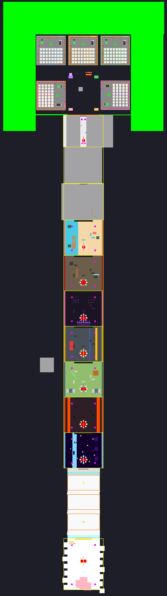

# Studio setup

`StealAChibi.rbxl` is ready to play: every part, tag and script below is already in it. This
page explains what's there, what you still need to do on the Roblox website, and how to
change the map without breaking the code.



*Top-down view of the built place: the 5 bases and Station Plaza at the top, zones 1-10 running down the corridor, the Gatekeeper's three terraces, and Celestial Sakura Heights at the bottom. Magenta dots are Guardian patrol points, red dots are Guardian spawns.*

## 1. Before you publish

| Where | What to do |
|---|---|
| Game Settings > Security | Turn on **Enable Studio Access to API Services** if you want saves to persist while testing in Studio. Without it, data lives in a mock store for the session. |
| Game Settings > Places | Set **Max Players to 5**, one per base. The build also writes `Players.MaxPlayers = 5`, but the website setting is the one that counts. |
| Creator Hub > Monetization | Create the gamepasses and developer products, then paste their IDs into `src/ReplicatedStorage/Shared/Config/Monetization.luau`. Items with `Id = 0` stay hidden. |
| Roblox group (optional) | Put your group ID in `GameSettings.GroupId` to enable the +10,000 Speed join reward. |
| Admins | The place owner (or the owning group's owner) is always an admin. Add more UserIds to `GameSettings.AdminUserIds`. In Studio everyone is an admin so you can test with the panel. |
| Music | `Config/Sounds.luau` has an empty slot per zone. Paste royalty-free Creator Store audio IDs (`rbxassetid://...`). The sound effects already use sounds that ship with Roblox. |

## 2. What the build did to your map

Nothing of yours was deleted. Everything was either kept in place or moved into a clearly
named folder.

| Your original | Now |
|---|---|
| `Base1`..`Base5` | Still in Workspace, tagged `Plot`, with a new `Fixtures` folder (pen slots, treadmill, register, collect plate, barrier, sign, spawn, outline). The floor `Part` is renamed `Floor`. |
| School walls + school floor | `Workspace.Map.Zones.Zone01_SakuraAcademy.Art` |
| `RamenStreet_AllInOne` | `Workspace.Map.Zones.Zone02_NeonRamenAlley.Art` |
| `KitsuneShrine_AllInOne` | `Workspace.Map.Zones.Zone03_KitsuneShrineForest.Art` |
| `HallMonitor` | `ServerStorage.Assets.Guardians.HallMonitor` (spawned at runtime as the zone 1 Guardian) |
| `RamenMaster` | `ServerStorage.Assets.Guardians.RamenMaster` (zone 2 Guardian, rigged automatically) |
| `Egg_Zone3_Blocky` | `ReplicatedStorage.Assets.Eggs.Egg_Zone3` (used as the shell of every zone 3 egg) |
| `Models` prop folder | `ServerStorage.Assets.Props` (still available to copy from) |
| Stray `RightWall_Glass_Optional` copy far from the school | `ServerStorage.Unsorted` |

Generated content lives in `Workspace.Map`: `Plaza`, `Zones` (gameplay parts and placeholder
architecture for zones 4-11), `Gauntlet` and `Boundaries` (invisible walls).

The build only regenerates things from `assets/base-map.rbxl`. Once you start editing the
place in Studio, treat **your saved .rbxl as the map** and use Rojo only for code (next
section).

## 3. Syncing code with Rojo

```bash
rokit install          # rojo, lune, luau-lsp, selene, stylua
rojo serve             # then click Connect in the Rojo Studio plugin
```

`default.project.json` only manages `ReplicatedStorage.Shared`,
`ServerScriptService.Server` and `StarterPlayerScripts.Client`, and ignores everything else,
so syncing never touches your map.

## 4. CollectionService tags the code relies on

Use the Tag Editor (View > Tags) to add these when you build new content. Attributes are set
in the Properties panel.

### Bases

| Tag | Put it on | Attributes / required names |
|---|---|---|
| `Plot` | the base Model | `PlotId` (number 1..5) |
| `PlotFloor` | the base's floor Part (the plot boundary) | - |
| `PenSlot` | each pedestal Part (6x1x6, oriented so -Z faces the entrance) | `SlotIndex` (1..40) |
| `Treadmill` | a Model containing a Part named **`Belt`** (parts named `Frame`, `Rail`, `Accent`, `Console` get recoloured per tier) | - |
| `CashRegister` | the register Part | - |
| `CollectPlate` | the collect plate Part | - |
| `BarrierButton` | the button Part | - |
| `BarrierField` | a large ForceField Part covering the plot (hidden until locked) | - |
| `PlotSign` | the sign board Part (text is drawn on its Front face) | - |
| `PlotSpawn` | an invisible Part where the owner respawns | - |

### Zones

| Tag | Put it on | Attributes |
|---|---|---|
| `Zone` | an invisible, non-colliding Part covering the zone's area | `ZoneId` |
| `Nest` | the nest centre Part | `ZoneId`, `Radius` |
| `EggPedestal` | each of the 8 pedestals | `ZoneId`, `PedestalIndex` (1..8) |
| `GuardianSpawn` | invisible spawn Parts (1, or 2 for zones 5+) | `ZoneId`, `Index` |
| `GuardianWaypoint` | invisible patrol points | `ZoneId`, `Order` (1..n, loops) |
| `ZoneGate` | the zone sign Part | `ZoneId` |

### Station Plaza

| Tag | Put it on | Attributes |
|---|---|---|
| `TrailShop`, `ItemShop`, `FusionPod`, `SellCounter`, `CodesBoard` | the kiosk counter Part (a prompt is added automatically) | - |
| `EventStage` | the Matsuri stage platform | - |
| `FestivalPedestal` | the 4 festival egg pedestals | `PedestalIndex` |
| `Leaderboard` | a board Part (drawn on its Front face) | `Board` = `TotalEarned`, `Rebirths` or `HighestIncome`; `Title` |

### Endgame

| Tag | Put it on | Attributes |
|---|---|---|
| `GauntletStart`, `GauntletFinish` | invisible trigger Parts | - |
| `GauntletArea` | invisible box per phase | `Phase` (1..3), `FloorY`, `OriginX/Y/Z` (ring origin / staff pivot) |
| `HeavenGate` | the gate barrier Part (opens locally for players who cleared) | - |
| `GauntletBoss` | the Heavenly Gatekeeper model (decorative) | - |
| `SacredIncubator` | the altar Part | - |

### Anything with text

`WorldLabel` on any Part plus the attributes `LabelText`, `LabelSubtext` (optional),
`LabelColor` (hex), `LabelFace` (`Front`, `Top`, ...) and `LabelBillboard` (true for a
floating label). The client draws it.

## 5. Replacing placeholder art

| Asset | Where it goes | Name |
|---|---|---|
| Character | `ReplicatedStorage.Assets.Characters` | the character's `ModelName`, e.g. `Char_KohanaNineTail` |
| Egg shell | `ReplicatedStorage.Assets.Eggs` | `Egg_Zone1`..`Egg_Zone11`, `Egg_Festival`, `Egg_Gacha`, `Egg_Duet`, `Egg_Rival`, `Egg_Eclipse` |
| Guardian | `ServerStorage.Assets.Guardians` | the zone's `Guardian.Template`, e.g. `Guardian_StoneKomainu` |

Models can be plain, unrigged meshes. The game adds a root part, welds, a Humanoid (for
Guardians), scaling, auras and mutation effects. Characters and eggs should have their feet
at the bottom of the model and face -Z. See `docs/ART_SPEC.md` for every character.

## 6. Adding content

- **A character:** add an entry in `Config/Characters.luau` (zone, rarity, base income, look,
  catchphrases). It spawns in that zone's nest, shows in the Index and gets a placeholder
  model automatically.
- **A zone:** add it to `Config/Zones.luau` and tag its Parts as in section 4.
- **A code, event, trail, treadmill tier, pen level or shop price:** edit the matching file in
  `Config/`. Run `lune run tools/simulate` afterwards to check pacing.

## 7. Testing in Studio

- Use **Test > Clients and Servers** with 2-3 players to test stealing, snatching and slaps.
- Everyone in Studio sees the **ADMIN** button: give cash or Speed, spawn eggs of any rarity or
  mutation, give characters, start events, grant gamepasses and products without Robux,
  clear the Gatekeeper and teleport to zones.
- Leaderboards and cross-server events need a published game with API access.
